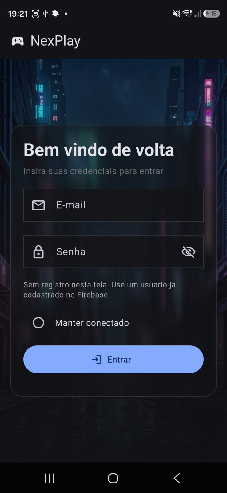
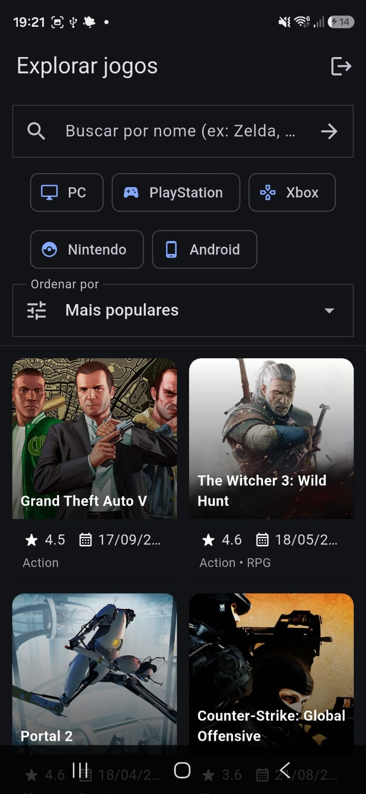
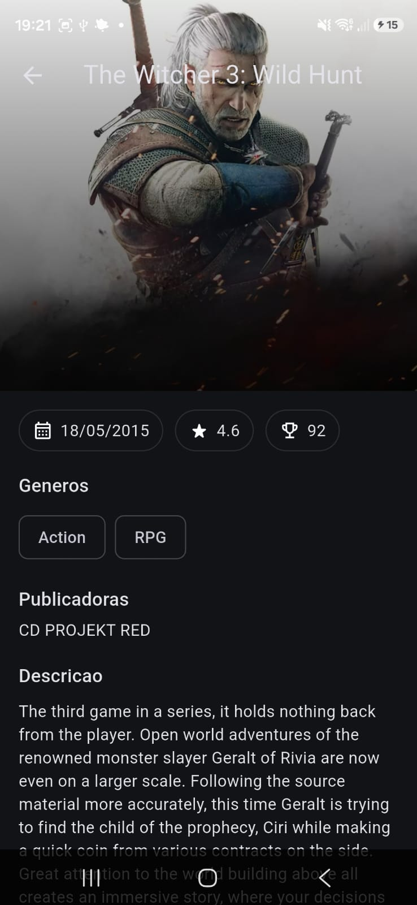
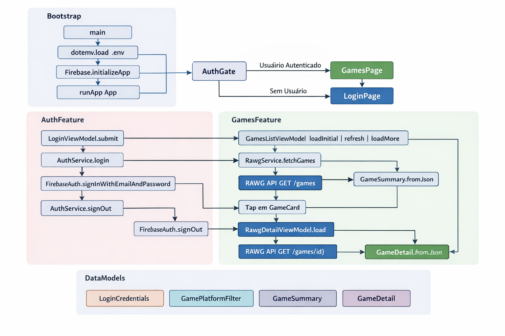

# Nexplay

Gerenciador de jogos com wishlist desenvolvido em Flutter para a disciplina de Desenvolvimento de Software para Dispositivos Moveis I.

[](https://github.com/LucMazarJR/nexplay/releases/latest)

## Download da build

- Ultima release: https://github.com/LucMazarJR/nexplay/releases/latest
- Arquivos da release (APK): publique o APK como asset da release para download direto.

## Objetivo

Construir um app mobile funcional para catalogar jogos, pesquisar titulos e manter uma wishlist pessoal, aplicando boas praticas de arquitetura com Flutter.

## O que foi implementado

- Autenticacao com Firebase (email e senha).
- Integracao com RAWG API para listagem de jogos.
- Tela de detalhes dos jogos.
- Filtros por plataforma na listagem.
- Persistencia de dados com Firestore.
- Organizacao por features usando padrao MVVM.
- Correcao de estabilidade no core (fix de crash de build).

## Funcionalidades

### Disponiveis

- Login com Firebase Authentication.
- Listagem de jogos consumindo RAWG.
- Filtros por plataforma.
- Visualizacao de detalhes de cada jogo.
- Wishlist com persistencia para o usuario autenticado.

### Proximos passos

- Busca avancada de jogos.
- Selecao aleatoria de jogos da wishlist.

## Stack

- Flutter
- Dart
- Firebase Core
- Firebase Auth
- Cloud Firestore
- HTTP
- flutter_dotenv

## Fotos do app

### Tela 1



### Tela 2



### Tela 3



## Arquitetura



## Estrutura do projeto

```text
lib/
	app/
	core/
	features/
		auth/
			model/
			service/
			view/
			viewmodel/
		games/
			model/
			service/
			view/
			viewmodel/
	main.dart
```

## Pre-requisitos

- Flutter SDK instalado.
- Dart SDK (vem com Flutter).
- Projeto Firebase configurado.
- Chave da RAWG API.

## Configuracao local

1. Clone o repositorio.
2. Crie o arquivo `.env` com base no `.env.example`.
3. Adicione a chave da RAWG no `.env`.
4. Adicione os arquivos de configuracao do Firebase para a plataforma.

Exemplo de `.env`:

```env
RAWG_API_KEY=sua_chave_aqui
```

Arquivos Firebase necessarios:

- Android: `android/app/google-services.json`
- iOS/macOS (se usar): `GoogleService-Info.plist`

## Como rodar

### Windows (PowerShell)

```powershell
git clone <url-do-repositorio>
cd nexplay
Copy-Item .env.example .env
flutter pub get
flutter run
```

### Linux/macOS

```bash
git clone <url-do-repositorio>
cd nexplay
cp .env.example .env
flutter pub get
flutter run
```

## Fluxo de login

- O app usa Firebase Authentication (email/senha).
- Nao ha tela de cadastro no app.
- Crie os usuarios no console do Firebase.

## Troubleshooting rapido

- Erro de `.env` nao encontrado: confirme se o arquivo `.env` existe na raiz.
- Erro de Firebase no Android: confirme `android/app/google-services.json` valido.
- Erro de dependencias: rode `flutter clean` e depois `flutter pub get`.

## Plataforma alvo

- Android

## Disciplina

Desenvolvimento de Software para Dispositivos Moveis I
